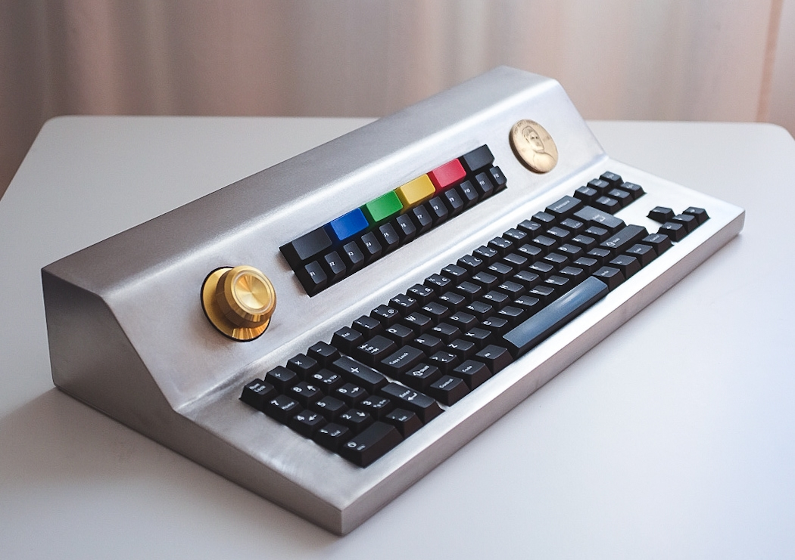

# monolith
A southpaw battlestation in stainless steel with a novel encoder solution.

Two more pics at the bottom, didn't have time to snap more before delivery.

## Introduction
In this guide I will, to the best of my ability, explain my entire process in detail from start to finish in way that you *can* build this for yourself if you like. I'm not saying that you should, but you will be able to. I'll be documenting this process for you *and* for myself, so bear with me when I start explaining things that are irrelevant to most people.

## Case design
I only had one real requirement for this build, a good knob. A second requirement I set for myself was for it to be comically heavy. However, milled steel doesnt come cheap and I wasnt looking for spending an entire months salary on a keyboard (just yet). I recently finished building a motorcycle so while the TIG-welder was still hot I thought that laser cut metal plates would reduce the materials cost significantly if I could weld something together.

With my limited knowledge of Fusion 360 I put this together with the newfound sheet metal workflow. The top part is 6mm thick, the walls are 8mm and the bottom plate is 2mm. The top is 6mm because I wanted to use a burger mounted switch place with thick, soft grommets to reduce sound as much as possible. The grommet builds another 1-2mm which places the top of the switch plate at approximately 7.5mm from top of case. This occludes the keycap edges. The back got a hole to accomodate a Weipu SF-12 connector that seemed to fit the theme of this build.

## Case construction
All parts were ordered from Fractory, which was a delightful experience. Just upload the parts you need, with bends and all, and they ship it out to you in about ten days. It's great if you don't have any local connections with those capabilities. All in all case parts with shipping and VAT costs about €329 today, but I ordered a *lot* of stuff for my motorcycle which lowered the overall price somewhat. I paid roughly half of that because of the reason above and sky-rocketing steel prices since the beginning of 2021.

Before welding I had to make threaded holes that would accept the shoulder bolts for the switch plates and encoder mount. I printed out alignment pieces that went into the switch plate, laid it down in the case and center-punched every hole. In hindsight I should've had Fractory mark out the hole centers when it was in the laser.

 I also had to make a counterbore in the back plate before welding because the Weipu connector didn't work on a 8mm panel, it shows two pictures down. But first, here are some shitty welds for you:

After this I temporarily spot-welded the bottom plate so I could drill holes in the case walls. This too, should've been marked on the bottom plate.

I then tapped all holes in M3. If you're not familiar, 304 Stainless is among the toughest materials to tap and doing this I wore out three taps, broke another three taps, one tap extractor and two very nice drill bits to a total cost of about €92. :-)

A small detail to add is that the walls didn't end up completely flat on the bottom because I wasn't paying attention during welding. I had to file them flat later on.

Finally, the case was finished with an orbital sander for a uniform look.

# Volume knob
Ah, what you came here for. 

Long story long, I started out by ordering some EC11 encoders because that's what everybody uses. It became evident quickly that they weren't up to the task because one, they arent sturdy enough to feel nice with a heavy aluminium knob. And two, the detents would barely register. I then found [this](https://www.aliexpress.com/wholesale?catId=0&initiative_id=SB_20220327141316&SearchText=omron+encoder) on AliExpres, it looked the part so I ordered two, one with 20PPR and one with 30PPR. With these two I could freely pick 10, 15, 20, 30 or 40 detents in software later on. The shaft is very rigid, there's no play whatsoever. It is likely supported by two bearings inside. 

I hope the schematic explains most of it, but to make detents for the smooth encoder I 3D printed a disc (in green) that holds twenty neodymium magnets and drilled holes for another twenty magnets in the knob. If you prefer (or can't) drill holes in the knob you could always print another disc and glue it semi-permanently to the knob. All magnets are mounted in the same polarity orientation in the disc, opposite polarity in the knob so that the disc and knob arrays attract. Use some glue to seal the magnets in place, I used epoxy for the disc and superglue for the knob.

In summary, I think this detent solution turned out great for a big knob. It has, however a tiny jiggle before it seats in a detent when you freewhel it and let it stop on its own. But I think that could be solved with a rubber shim, less detents or something along those lines.

# Electronics
Since I have no experience designing PCB's I opted for the handwired route, in hindsight I should've just learned KiCad because it probably would have saved me some time in the end. This is what ~1600 solder joints look like: 

It's got a Teensy++ 2.0 to handle the big matrix that consist of a whole bunch of [Amoeba](https://github.com/mtl/keyboard-pcbs/tree/master/amoeba) PCB's. It also has full backlight, powered by a mosfet and PWM.

# Contact
I'm on reddit and discord as sincerelyredcape aswell, shoot me a message if you have any questions.